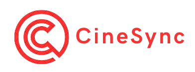

# 🎬 CineSync

<div align="center">
  
  <h3>Your Ultimate Movie Streaming Experience</h3>
  
  
  
  
  
</div>

## ✨ Overview

CineSync is a modern, responsive movie streaming platform built with React. It offers an intuitive interface for browsing, searching, and enjoying films and TV series with a focus on user experience and visual appeal.

<div align="center">
  
</div>

## 🚀 Features

- **Sleek User Interface**: Modern design with smooth animations and responsive layout
- **Movie Showcase**: Browse trending, upcoming, and recommended movies
- **Detailed Movie Pages**: View comprehensive information with trailers, descriptions, and more
- **Smart Search**: Quickly find movies by title, genre, or keywords
- **Category Navigation**: Browse content by series, movies, or other classifications
- **Interactive Video Player**: Enhanced video experience with custom controls
- **Social Sharing**: Share favorite movies across multiple platforms
- **Tabbed Content**: Easy navigation between details, cast, and similar movies

## 🔧 Getting Started

### Prerequisites

- Node.js (v14 or later)
- npm or yarn

### Installation

1. Clone the repository:
   ```bash
   git clone https://github.com/your-username/CineSync.git
   cd CineSync
   ```

2. Install dependencies:
   ```bash
   npm install
   # or
   yarn install
   ```

3. Start the development server:
   ```bash
   npm start
   # or
   yarn start
   ```

4. Open your browser and navigate to:
   ```
   http://localhost:3000
   ```

## 🏗️ Project Structure

```
CineSync/
├── public/               # Public assets and HTML template
│   ├── images/           # Image assets
│   └── videos/           # Video assets
├── src/                  # Source code
│   ├── components/       # React components
│   │   ├── footer/       # Footer component
│   │   ├── header/       # Header and navigation components
│   │   ├── homes/        # Home page components
│   │   ├── trending/     # Trending section components
│   │   ├── upcoming/     # Upcoming releases components
│   │   └── watch/        # Video player and movie detail components
│   ├── home/             # Home page container
│   ├── dummyData.js      # Sample data for development
│   ├── App.js            # Main application component
│   ├── App.css           # Global styles
│   └── index.js          # Application entry point
└── package.json          # Project dependencies and scripts
```

## 💻 Usage

### Navigation

- **Home**: Browse featured and trending content
- **Series**: Filter content to view series only
- **Movies**: Browse all available movies
- **Search**: Find content using the search icon in the header
- **Single Movie**: Click on any movie poster to view detailed information

### Video Playback

1. Navigate to any movie detail page
2. Click the play button on the poster image
3. Use the video controls to manage playback
4. Click anywhere outside to return to browsing

## 📱 Responsive Design

CineSync is built with a mobile-first approach, ensuring a fantastic experience across devices:

- **Desktop**: Full featured experience with side-by-side layouts
- **Tablet**: Optimized navigation and grid layouts
- **Mobile**: Streamlined interface with touch-friendly controls

## 🛠️ Technology Stack

- **React**: Front-end library for building the user interface
- **React Router**: For navigation between pages
- **CSS3**: Custom styling with animations and transitions
- **FontAwesome**: For icons and visual elements
- **Local Storage**: For saving user preferences (upcoming)

## 🧪 Development

### Available Scripts

- `npm start`: Runs the app in development mode
- `npm test`: Launches the test runner
- `npm run build`: Builds the app for production
- `npm run eject`: Ejects the create-react-app configuration

### Customization

- **Theme**: Modify the CSS variables in `App.css` to change the color scheme
- **Content**: Update `dummyData.js` to add or modify available movies

## 🔮 Future Enhancements

- User authentication and profiles
- Watchlist and favorites functionality
- Advanced filtering and sorting options
- Rating and review system
- Recommendation engine based on viewing history
- Integration with external movie databases

## 📃 License

This project is licensed under the MIT License - see the LICENSE file for details.

## 🙏 Acknowledgements

- Movie posters and descriptions are used for demonstration purposes only
- Icons provided by [Font Awesome](https://fontawesome.com/) and [Icons8](https://icons8.com/)
- Design inspiration from various streaming platforms

---

<div align="center">
  <p>Made by Your Naman Negi</p>
  <p>© 2025 CineSync. All rights reserved.</p>
</div>
